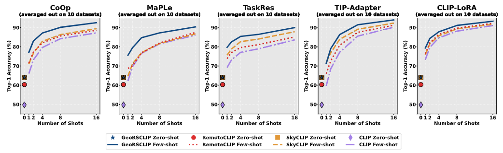

# 🔧🔧UNDER CONSTRUCTION🔧🔧

# Few-Shot Adaptation Benchmark for Remote Sensing Vision-Language Models

<a href="https://arxiv.org/abs/2510.07135" style='vertical-align:middle; display:inline;'></a>

Welcome to the GitHub repository for [Few-Shot Adaptation Benchmark for Remote Sensing Vision-Language Models](https://arxiv.org/abs/2510.07135).

 
<ins>Authors:</ins>

[K. El Khoury](https://scholar.google.be/citations?user=UU_keGAAAAAJ&hl=fr), [M. Zanella](https://scholar.google.com/citations?user=FIoE9YIAAAAJ&hl=fr&oi=ao), [C. De Vleeschouwer](https://scholar.google.ca/citations?user=xb3Zc3cAAAAJ&hl=en), [B. Macq](https://scholar.google.be/citations?user=H9pGN70AAAAJ&hl=fr)

 <br>
<br>

## Updates
* **Paper uploaded on arXiv. [October 9, 2025]**

<br><br>


We introduce the first structured benchmark to evaluate and compare RSVLMs under a few-shot setting.

<p align="center">
  
  <br>
  <em>Figure 1: Performance evaluation of four vision-language models (<strong><span style="color: #134A82;">GeoRSCLIP</span></strong>, <strong><span style="color: #DC2E2E;">RemoteCLIP</span></strong>, <strong><span style="color: #E19838;">SkyCLIP</span></strong>, and <strong><span style="color: #A582E7;">CLIP</span></strong>) using five different few-shot adaptation methods.</em>
</p>


<br>
<br>

## Setup 🔧

<ins>NB:</ins> the Python version used is 3.10.12.

<br>

Create a virtual environment and activate it:

```bash
# Example using the virtualenv package on linux
python3 -m pip install --user virtualenv
python3 -m virtualenv FSRS-venv
source FSRS-venv/bin/activate.csh
```

Install Pytorch:
```bash
pip3 install torch==2.2.2 torchaudio==2.2.2 torchvision==0.17.2
```

Clone GitHub and move to the appropriate directory:

```bash
git clone https://github.com/elkhouryk/FSRS-venv
cd FSRS-venv
```

Install the remaining Python packages requirements:
```bash
pip3 install -r requirements.txt
```

<br>

You are ready to start! 🎉

---

<br>
<br>


## Datasets 🗂️


10 Remote Sensing Scene Classification datasets are already available for evaluation: 

* The whurs19 dataset is already uploaded to the repository for reference and can be used directly.


### Step 1 Dataset Download
  
* The following 6 datasets (eurosat, optimal31, patternnet, resisc45, rsc11, rsicb256) will be automatically downloaded and formatted from Hugging Face using the _run_dataset_download.py_ script.

```bash
# <dataset_name> can take the following values: eurosat, optimal31, patternnet, resisc45, rsc11, rsicb256
python3 run_dataset_download.py --dataset_name <dataset_name> 
```

  
* You must download the aid, mlrsnet and rsicb128 datasets manually from Kaggle and place them in '/datasets/' directory. You can format them manually to follow the dataset directory structure listed above and use them for evaluation **OR** you can use the _run_dataset_download_2.py_ script by placing the .zip files from Kaggle in the '/datasets/' directory.


```bash
# <dataset_name> can take the following values: aid, mlrsnet, rsicb128
python3 run_dataset_download_2.py --dataset_name <dataset_name> 
```

* Download links: [aid](https://www.kaggle.com/datasets/jiayuanchengala/aid-scene-classification-datasets) | [rsicb128](https://www.kaggle.com/datasets/noamaanabdulazeem/myfile) | [mlrsnet](https://www.kaggle.com/datasets/fes2255/mlrsnet) --- <ins>NB:</ins> On the Kaggle website, click on the download **Arrow** in the center of the page instead of the **Download** button to preserve the data structure needed to use the run_dataset_formatting.py_ script (check figure bellow).


<p align="center">
  
  <br>
</p>


<br>


After these steps your datasets directory structure should be as follows:
```
$datasets/
└── <dataset_name>/
  └── classes.txt
  └── class_changes.txt
  └── images/
    └── <classname>_<id>.jpg
    └── ...
```

### Step 2 Dataset Partitioning

* Create train/val/test partitions

```bash
# <dataset_name> can take the following values: aid, eurosat, mlrsnet, optimal31, patternnet, resisc45, rsc11, rsicb128, rsicb256
python3 run_dataset_partition.py --dataset_name <dataset_name> 
```

After this step your datasets directory structure should be as follows:

```
$datasets/
└── <dataset_name>/
  └── classes.txt
  └── class_changes.txt
  └── images/
    └── train/
      └── <classname>_<id>.jpg
    └── val/
      └── <classname>_<id>.jpg
    └── test/
      └── <classname>_<id>.jpg
```

### Step 3 Dataset Formatting

* Setup the final dataset format following the format from [CoOp]([https://www.kaggle.com/datasets/jiayuanchengala/aid-scene-classification-datasets](https://github.com/KaiyangZhou/CoOp)).

```bash
# <dataset_name> can take the following values: aid, eurosat, mlrsnet, optimal31, patternnet, resisc45, rsc11, rsicb128, rsicb256
python3 run_dataset_formatting.py --dataset_name <dataset_name> 
```

After this step your final datasets directory structure should be as follows:

```
$datasets/
└── <dataset_name>/
  └── 2750/
    └── <classname>/
      └── <classname>_<id>.jpg
  └── split.json
```
  
